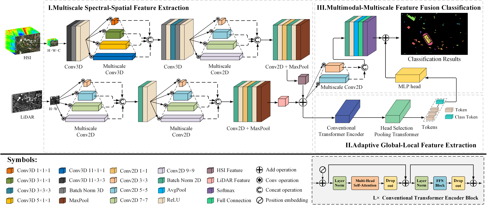

# MHST-Net
This an official Pytorch implementation of our paper "**MHST: Multiscale Head Selection Transformer for Hyperspectral and LiDAR Classification**".You can find [the PDF of this paper]().

****
# Datasets
- [Houston](https://hyperspectral.ee.uh.edu/?page_id=459)
- [Trento](https://github.com/danfenghong/IEEE_GRSL_EndNet/blob/master/README.md)
****
# Train MHST-Net
``` 
python demo.py
``` 
****
# Results
| Dataset | OA (%) | AA (%) | Kappa (%) |
| :----: |:------:|:------:|:---------:|
| Houston  | 96.19  | 96.80  |   95.88   |
| Trento  | 99.45  | 99.09  |   99.26   |
****
# Citation
If you find this paper useful, please cite:
``` 
@ARTICLE{,
  author={Kang Ni, Duo Wang, Zhizhong Zheng},
  journal={}, 
  title={}, 
  year={2023},
  volume={},
  number={},
  pages={},
  doi={}
}
```
****
# Contact
Duo Wang: [b21041510@njupt.edu.cn](b21041510@njupt.edu.cn)
